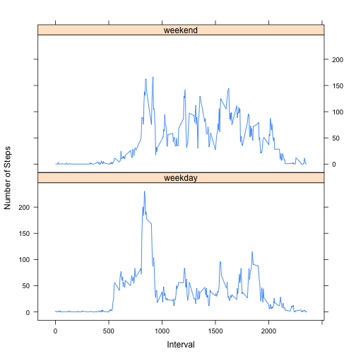

# Reproducible Research - Peer Assignment 1


```r
library(knitr)
opts_chunk$set(echo = TRUE)
library(dplyr)
library(lattice)
library(lubridate)
```

## Loading and preprocessing the data
1. Load the data.
2. Process/transform the data into a format suitable for your analysis.

```r
setwd("/Users/aryaviswanathan/Desktop/Data Science Specialization/Course 5 - Reproducible Research/Week 2")
data <- read.csv("activity.csv",header=TRUE,sep=",")
data$date <- ymd(data$date)
str(data)
```

```
## 'data.frame':	17568 obs. of  3 variables:
##  $ steps   : int  NA NA NA NA NA NA NA NA NA NA ...
##  $ date    : POSIXct, format: "2012-10-01" "2012-10-01" ...
##  $ interval: int  0 5 10 15 20 25 30 35 40 45 ...
```

## What is mean total steps taken per day?
1. Calculate the total number of steps taken per day.
2. Make a histogram of the total number of steps taken each day.
3. Calculate and report the mean and median of the total number of steps taken per day.

```r
steps_per_day <- aggregate(data$steps ~ data$date, FUN=sum)
colnames(steps_per_day)<- c("Date", "Steps")
hist(steps_per_day$Steps,main="Total Steps Per Day",xlab="Steps")
```


```r
mean_steps <- mean(steps_per_day$Steps,na.rm=TRUE)
median_steps <- median(steps_per_day$Steps,na.rm=TRUE)
```

```r
mean_steps
```

```
## [1] 10766.19
```

```r
median_steps
```

```
## [1] 10765
```
1.0766189 &times; 10<sup>4</sup> is the mean number of steps taken per day and 10765 is the median number of steps taken per day.

## What is the average daily activity pattern?
1. Make a time series plot of the 5-minute interval (x-axis) and the average number of steps taken, averaged across all days (y-axis).
2. Which 5-minute interval, on average across all the days in the dataset, contains the maximum number of steps?

```r
steps_per_interval <- aggregate(data$steps ~ data$interval, FUN=mean)
colnames(steps_per_interval)<- c("Interval", "Steps")
plot(steps_per_interval$Interval,steps_per_interval$Steps,type="l",main="Average Number of Steps per Day by Interval",xlab="Interval",ylab="Number of Steps")
```


```r
max_interval <- steps_per_interval[which.max(steps_per_interval$Steps),]
```

Interval 835 is the 5-minute interval, on average across all the days in the dataset, that contains the maximum number of steps with 206.1698113 steps.

##Imputing missing values
1. Calculate and report the total number of missing values in the dataset (i.e. the total number of rows with NAs.
2. Devise a strategy for filling in all of the missing values in the dataset. The strategy does not need to be sophisticated. For example, you could use the mean/median for that day, or the mean for that 5-minute interval, etc.
3. Create a new dataset that is equal to the original dataset but with the missing data filled in.
4. Make a histogram of the total number of steps taken each day and Calculate and report the mean and median total number of steps taken per day. Do these values differ from the estimates from the first part of the assignment? What is the impact of imputing missing data on the estimates of the total daily number of steps?

```r
sum(is.na(data$steps))
```

```
## [1] 2304
```

There are 2304 missing values in the dataset.

My strategy for filling in all of the missing values in the dataset is to use the mean for that 5-minute interval.

```r
data2 <- data
for (i in 1:nrow(data2)) {
  if (is.na(data2$steps[i])) {
    data2$steps[i] <- steps_per_interval[which(data2$interval[i]==steps_per_interval$Interval), ]$Steps
  } else {
    data2$steps[i]
  }
}
head(data2)
```

```
##       steps       date interval
## 1 1.7169811 2012-10-01        0
## 2 0.3396226 2012-10-01        5
## 3 0.1320755 2012-10-01       10
## 4 0.1509434 2012-10-01       15
## 5 0.0754717 2012-10-01       20
## 6 2.0943396 2012-10-01       25
```


```r
steps_per_day_2 <- aggregate(data2$steps ~ data2$date, FUN=sum)
colnames(steps_per_day_2)<- c("Date", "Steps")
hist(steps_per_day_2$Steps,main="Total Steps Per Day",xlab="Steps")
```


```r
mean_steps_2 <- mean(steps_per_day_2$Steps)
median_steps_2 <- median(steps_per_day_2$Steps)
```


```r
mean_steps_2
```

```
## [1] 10766.19
```

```r
median_steps_2
```

```
## [1] 10766.19
```

1.0766189 &times; 10<sup>4</sup> is the mean number of steps taken per day and 1.0766189 &times; 10<sup>4</sup> is the median number of steps taken per day. The impact of imputing missing data on the estimates of the total daily number of steps is that the mean remains the same and the median slightly increases.

## Are there differences in activity patterns between weekdays and weekends?
1. Create a new factor variable in the dataset with two levels – “weekday” and “weekend” indicating whether a given date is a weekday or weekend day.
2. Make a panel plot containing a time series plot of the 5-minute interval (x-axis) and the average number of steps taken, averaged across all weekday days or weekend days (y-axis). See the README file in the GitHub repository to see an example of what this plot should look like using simulated data.

```r
for (i in 1:nrow(data2)) {
  if (weekdays(data2$date[i])=="Saturday" | weekdays(data2$date[i])=="Sunday") {
    data2$day[i] <- "weekend"
  } else {
    data2$day[i] <- "weekday"
  }
}
data2$day <- as.factor(data2$day)
head(data2)
```

```
##       steps       date interval     day
## 1 1.7169811 2012-10-01        0 weekday
## 2 0.3396226 2012-10-01        5 weekday
## 3 0.1320755 2012-10-01       10 weekday
## 4 0.1509434 2012-10-01       15 weekday
## 5 0.0754717 2012-10-01       20 weekday
## 6 2.0943396 2012-10-01       25 weekday
```


```r
day_data <- aggregate(steps ~ interval + day, data=data2, FUN="mean")
xyplot(day_data$steps ~ day_data$interval | day_data$day, layout=c(1,2),type="l",xlab="Interval", ylab="Number of Steps")
```


